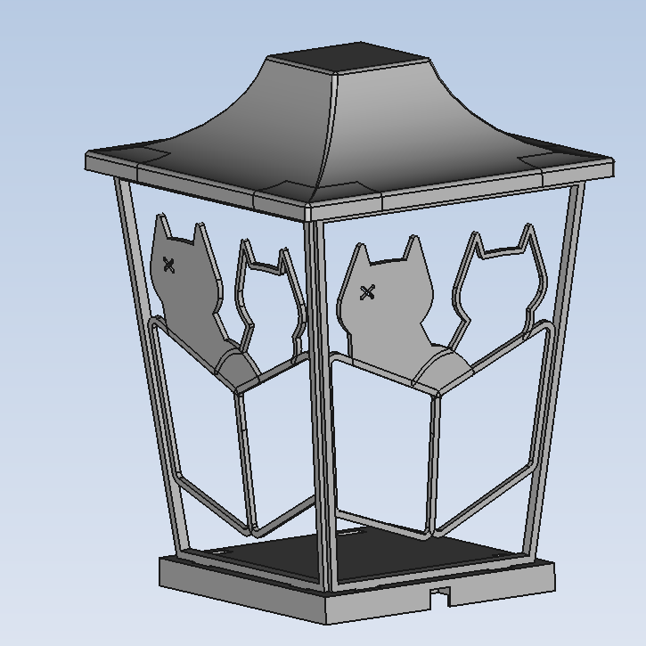

    
    <h1 align="center">Schrodingers Lantern</h1>
     

This lantern is a graduation present for our klushok committee member Werner.

## Concept

## Firmware

 - async wifi manager
 - async webserver
 - webinterface which makes requests to the esp server
 - api on the esp implements functionality

## error messages

### 2 short green flashes
All good, there were not issues when booting the lantern!

### 2 short red flashes
No wifi connection could be established

### 4 long red flashes
The SPIFFS memory could not (correctly) be read. To solve this, power cycle the lantern.

## 2 short blue flashes
Something went wrong, please power cycle the lantern.

### Installation
To upload HTML and CSS files to the SPIFFS of the ESP32, follow these instructions [randomnerdtutorials.com/install-esp32-filesystem-uploader-arduino-ide/](https://randomnerdtutorials.com/install-esp32-filesystem-uploader-arduino-ide/)