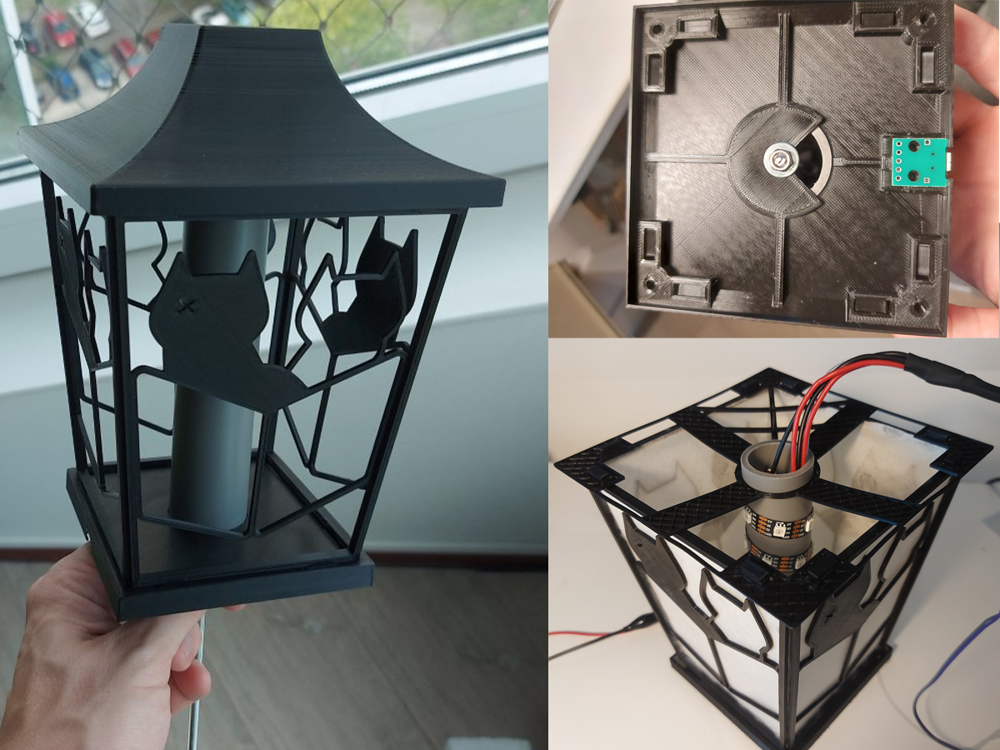
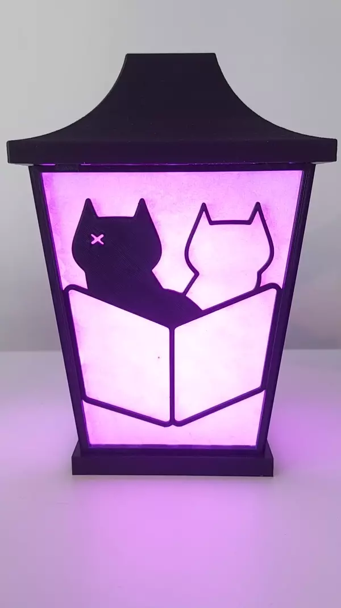
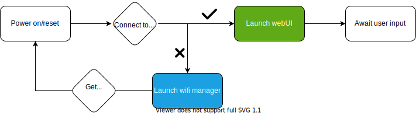
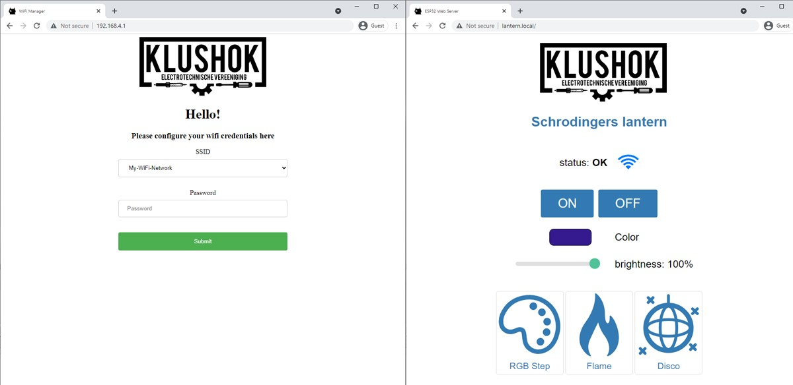
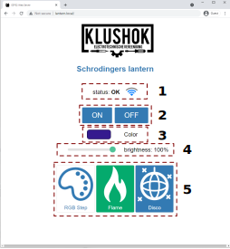

    
    <h1 align="center">Schrodingers Lantern</h1>
     

This lantern is a graduation present for our klushok committee member Werner. One of his many contributions to the klushok was the "schrodingers box": a mystery box which contains multiple small projects. 

The sides of the lantern contain a modified version of the schrodingers box logo behind which a filter is glued. 
This filter diffuses the light from an LED string attached to a central cylinder.
The lantern is connected to power via a micro usb connector in the bottom and controlled via an ESP32 hidden in the top.
The lantern can be turned on or off via a capacitive sensor hidden just below the top center square, further control like setting colors and effects can be done via the user interface hosted by the ESP32. This interface will be called the webUI.

To ensure the rigidity of the lantern, the top is connected to the bottom via a m4 threaded rod down the center of the LED cylinder.
The sides lock into place using printed tabs.

A total of 35 WS2813 LEDs have been used which require 1.5A @ 5V when showing white on max brightness. Another 500mA is required by the esp32 causing the lantern to require a 5V power supply which can deliver at least 2A.
Most usb chargers can satisfy this requirement but make sure to validate this before use.

## Firmware
The firmware of the lantern is the most challenging part because once the lantern is closed off, the ESP cannot be reached.

The required funtionallity is:
 - Over the Air (OTA) flashing/file upload
 - A wifi manager to (re)connect to a network without requiring reflashing credentials
 - A webinterface to control the lantern
 - Physical button(s) to turn the lantern on/off
 - An api to allow integrating the lantern into existing home automation systems

The state diagram below shows the steps taken when the lantern is connected to power.
 
The color of the 'launch webUI' and 'launch wifi manager' block represent the boot message presented when that route is taken. See section [boot messages](#boot-messages) for a more detailed description of all possible boot messages.

### Connect to WiFi

When Schrodinigers lantern is connected to power for the first time or the previously stored wifi credentials won't work, the wifi manger is launched.
This wifi manager will create a wireless network to which the user can connect using the credentials defined in the `credentials.h` file.

By default this network is called "Schrodingers lantern" and uses the password "Schrodinger" as defined in `credentials.h.template`. 

Connect to this network and visit [http://192.168.4.1](http://192.168.4.1), the left interface from the figure below should appear.

Select your network from the dropdown menu, enter your wifi credentials and press "Submit". The ESP will restart and  you will be redirected to the webUI using mDNS.

If the wifi credentials are correct, the lantern will blink green on restart and the webUI (right interface from figure below) will appear after a few seconds. If the lantern blinks blue, a wifi connection could not be established and the wifi manager will be launched again.

### Troubleshooting
If the webUI does not appear after entering your credentials in the wifi manager, follow these steps until the webUI appears:

1. Refresh the page
2. Chances are your device (like most android devices) does not support mDNS, use tools like nmap or other network analysers to obtain the local ip address of the lantern and use it to connect instead.
3. Power cycle the lantern, wait until the green boot message has appeared and try to connect again.

### Using the webUI

1. Status field. This field will update every few seconds to display the connection status and signal strength of the lantern. Upon a connection loss, the status will change to "Connecting..." until a connection was re-established. When a connection is re-established, all settings on the webUI will be updated. 
2. On/Off buttons. These can be used to toggle the lantern on or off. Any color or effect settings will be maintaned when switching the lantern on or off.
3. The color swatch can be clicked to expand and select a color. Tapping outside the expanded area will submit the new color request to the lantern.
4. Brightness control is a global setting. This means that both effects and solid colors can be set to any brightness using this slider.
5. The effect panel shows the 3 built-in effects. In this figure the RGB Step effect is not selected nor active, the Flame effect is active and thus displayed on the lantern, the Disco effect is hovered over by the mouse but not active.
Clicking on a panel will turn it on (and disable all other effects).

### API
The API endpoints which are added by default are listed below. Some endpoints require parameters, if these parameters are not set a status 400 will be returned alongside an error message.

| Method| Endpoint | Description                   |
| ---   | ---      | ---                           |
| GET   | /api/status | Get the current settings and connection status |
| GET   | ​/api/set    | Set the color and brightness of the lantern: `brightness=0-255` or `red & blue & green=0-255` |
| GET   | ​/api/effect | Set the effect by means of <code>id= 0 &#124; 1 &#124; 2</code> and <code>state= 0 &#124; 1 </code> |
| GET   | /api/toggle | Toggle the lantern on or off by passing <code>state= 1 &#124; 0</code> |
| GET   | /api/reset  | Reset the currently stored wifi credentials |

## Updating the firmware
The firmware consists of two parts:
1. The files for the webUI, stored on the SPIFFS memory.
2. The arduino sketch, stored on the sketch partition.

To upload the files required by the webUI to the SPIFFS of the ESP32, a plugin for the arduino IDE is required.
Follow these instructions to add the plugin to the arduino IDE [randomnerdtutorials.com/install-esp32-filesystem-uploader-arduino-ide/](https://randomnerdtutorials.com/install-esp32-filesystem-uploader-arduino-ide/).

The arduino sketch files can be uploaded using the built-in OTA uploader from the arduino IDE.

### WARNING
- It is highly advised to test uploads on a separate esp32 board before uploading to the lantern.
The usb port and flash button are only accesible when the lantern is disassembled, any runtime errors which prevent the OTA upload handler to start will therefore completely block the lantern and require dissasembly to fix!

- If the OTA functionality is not added to the new sketch, it won't be possible to upload a new sketch without disassembling the lantern.

### SPIFFS
When adding files to the SPIFFS, it is important to keep in mind that there is a limit of 32 chars in total for filenames. One '\0' char is reserved for C string termination, so that leaves us with 31 usable characters.

That means it is advised to keep filenames short and not use deeply nested directories, as the full path of each file (including directories, '/' characters, base name, dot and extension) has to be 31 chars at a maximum. For example, the filename `/website/images/bird_thumbnail.jpg` is 34 chars and will cause some problems if used, for example in `exists()` or in case another file starts with the same first 31 characters. [[source](https://arduino-esp8266.readthedocs.io/en/latest/filesystem.html)]

### data upload
The suggested data uploader does work over OTA provided there is no password set. To upload the data contained on the SPI storage of the ESP32 you could therefore first flash firmware without an OTA password, upload the data folder and then reflash with OTA password. After uploading the data folder you will have to go through the wifi manager to reconnect to your local network.
Don't forget to reflash again with a new password set otherwise anyone on your network is able to flash the lantern with new firmware.

Alternatively there are tools available which can generate ([spiffsgen.py](https://github.com/espressif/esp-idf/blob/166c30e7b2ed1dcaae56179329540a862915208a/components/spiffs/spiffsgen.py)) and upload ([otatool.py](https://github.com/espressif/esp-idf/blob/166c30e/components/app_update/otatool.py)) spiffs data.

## Boot messages

### 4 long red flashes
The SPIFFS memory could not (correctly) be read. The lantern will restart automatically. If this keeps happening, connect a usb cable to the ESP to check what is happening via the serial bus.

### 2 short green flashes
All good, there were not issues when booting the lantern! You can use the mDNS configured hostname to access the webUI and API.

### 2 short orange flashes
mDNS could not be initialized, the lantern can only be reached using its ip address. This address can be obtained using tools like nmap.

### 2 short blue flashes
The lantern is in AP mode, follow the [Connect to wifi](#Connect-to-wifi) steps.

# Known points of improvement
- rescanning for wifi networks requires a device reboot, this should be built into the wifi manager.
- A wifi connection is required for the API and webUI to deploy, these should both be launched alongside the wifimanager if no network connection is detected. Although the webUI and API requires an active wifi connection, the capacitive sensor hidden in the top of the lantern still works to toggle the latest saved settings on or off.

# more info

The design files and firmware can be found on the klushok github:

