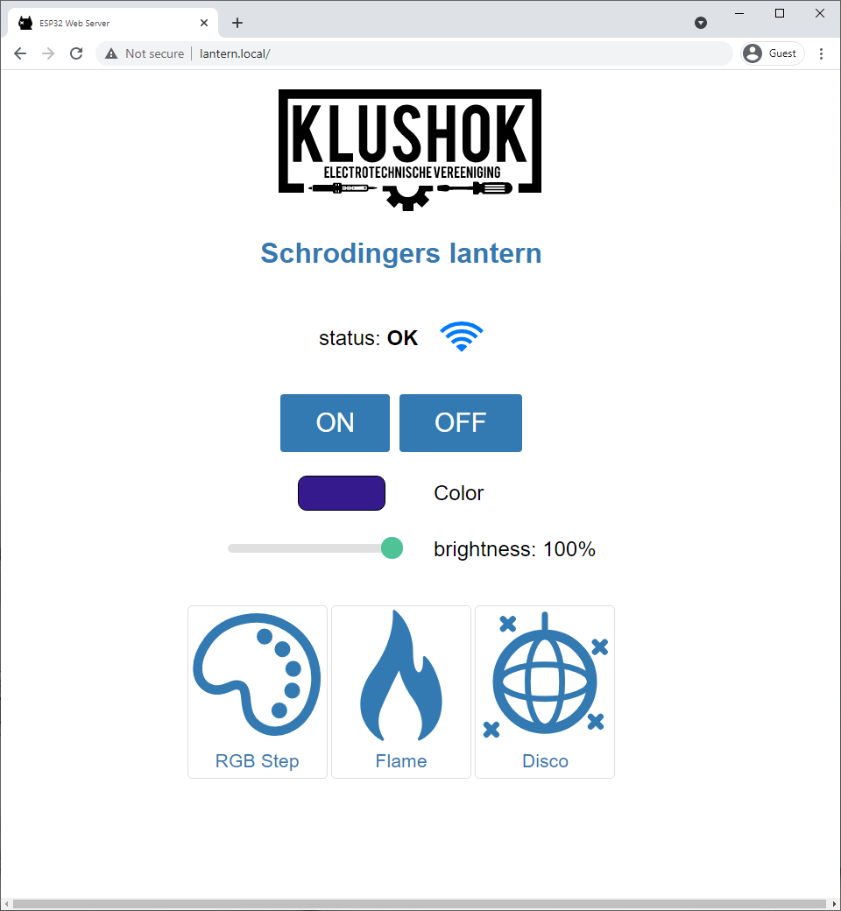

    
    <h1 align="center">Schrodingers Lantern</h1>
     

This lantern is a graduation present for our klushok committee member Werner.

## Concept

The concept is based on the logo from Schrodingers Box: a mysterybox containing random projects and components created by Werner.
The sides of the lantern contain a modified version of the logo behind which a filter is glued. 
This filter diffuses the light from an LED string attached to a central cylinder.
The lantern is connected to power via a micro usb connector in the bottom and controlled via an ESP32 hidden in the top.
The lantern can be turned on or off via a capacitive sensor hidden just below the top center square, further control like setting colors and effects can be done via the user interface hosted by the ESP32 called the webUI.

To ensure the rigidity of the lantern, the top is connected to the bottom via a m4 threaded rod down the center of the LED cylinder.
The sides lock into place using printed tabs.

## Firmware

 - async wifi manager
 - async webserver
 - webinterface which makes requests to the esp server
 - api on the esp implements functionality

 It is highly advised to test uploads on a separate esp32 board before uploading to the lantern.
 The usb port and flash button are only accesible when the lantern is disassembled, any runtime errors which prevent the OTA upload handler to start will therefore completely block the lantern and require dissasembly to fix.

### SPIFFS
There is a limit of 32 chars in total for filenames. One '\0' char is reserved for C string termination, so that leaves us with 31 usable characters.

That means it is advised to keep filenames short and not use deeply nested directories, as the full path of each file (including directories, '/' characters, base name, dot and extension) has to be 31 chars at a maximum. For example, the filename `/website/images/bird_thumbnail.jpg` is 34 chars and will cause some problems if used, for example in `exists()` or in case another file starts with the same first 31 characters. [[source](https://arduino-esp8266.readthedocs.io/en/latest/filesystem.html)]

### data upload
The suggested data uploader does work over OTA provided there is not password set. To upload the data contained on the SPI storage of the ESP32 you could therefore first flash firmware without an OTA password, upload the data folder and then reflash with OTA password. After uploading the data folder you will have to go through the wifi manager to reconnect to your local network.

Alternatively there are tools available which can generate ([spiffsgen.py](https://github.com/espressif/esp-idf/blob/166c30e7b2ed1dcaae56179329540a862915208a/components/spiffs/spiffsgen.py)) and upload ([otatool.py](https://github.com/espressif/esp-idf/blob/166c30e/components/app_update/otatool.py)) spiffs data.

### Connect to WiFi

visit the network "Schrodingers lantern"

Select your network from the dropdown menu, enter your wifi credentials and press "Submit". The ESP will restart and if the wifi credentials are correct you will be redirected to the webUI using mDNS.

## Boot messages

### 4 long red flashes
The SPIFFS memory could not (correctly) be read. The lantern will restart automatically. If this keeps happening, connect a usb cable to the ESP to check what is happening via the serial bus.

### 2 short green flashes
All good, there were not issues when booting the lantern! You can use the mDNS configured hostname to access the webUI and API.

### 2 short orange flashes
mDNS could not be initialized, the lantern can only be reached using its ip address. This address can be obtained using tools like nmap.

## 2 short blue flashes
The lantern is in AP mode, follow the [Connect to wifi](#Connect-to-wifi) steps.

### Installation
To upload HTML and CSS files to the SPIFFS of the ESP32, follow these instructions [randomnerdtutorials.com/install-esp32-filesystem-uploader-arduino-ide/](https://randomnerdtutorials.com/install-esp32-filesystem-uploader-arduino-ide/)

# Known points of improvement
- rescanning for wifi networks requires a device reboot, this should be built into the wifi manager